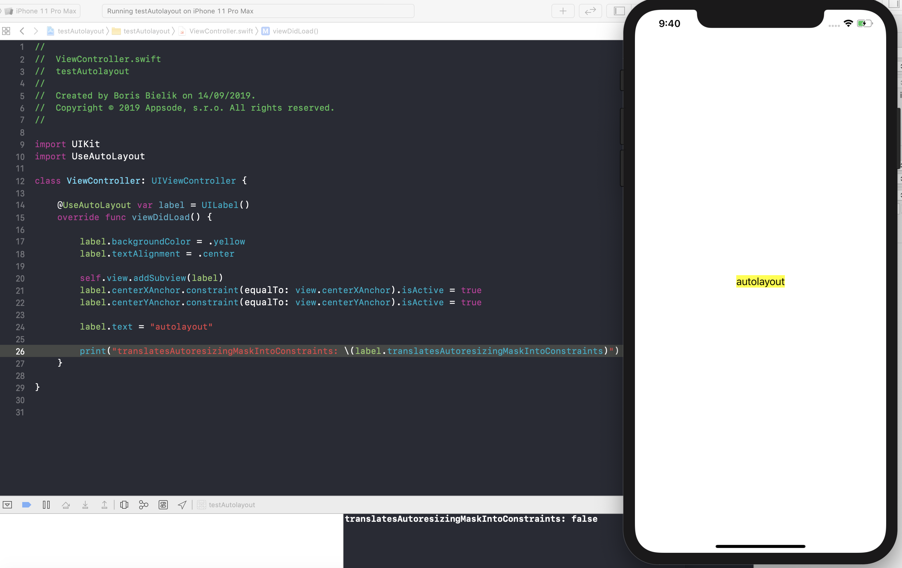

# @UseAutoLayout
Property wrapper that enables autolayout on applied views.

# Declaration:

`@UseAutoLayout` property wrapper

```
@propertyWrapper
public struct UseAutoLayout<T: UIView> {
    var value: T

    public var wrappedValue: T {
      get { return value }
      set { self.value.translatesAutoresizingMaskIntoConstraints = false }
    }

    public init(wrappedValue: T) {
      value = wrappedValue
    }
}

```

# Usage

```
@UseAutoLayout var label = UILabel()
```


## Installation

Property wrappers are defined in Swift 5.1.
Using @UseAutoLayout requires Xcode 11.0(and above) and Swift 5.1 toolchain


### Swift Package Manager

Add 
`.package(url: "https://github.com/bielikb/UseAutoLayout.git", from: "1.0.0")` 
to your `Package.swift` file's `dependencies`.

If youre using Xcode 11.0 add this Swift Package to your target(s) using Xcode.

# Example



---


